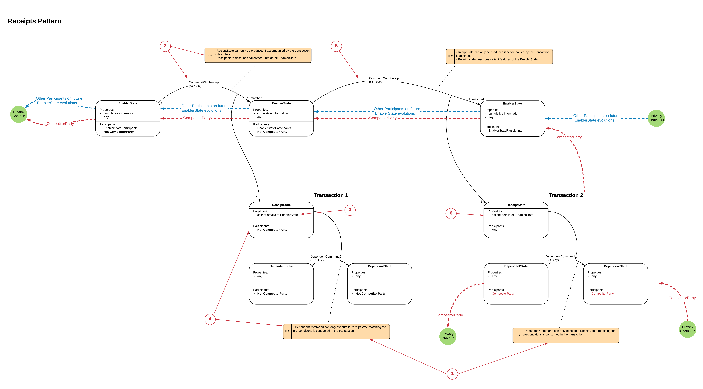

================
Receipts Pattern
================

:Status: Peer reviewed
:Implemented: No (abstract/ foundational Pattern)

-------
Summary
-------

Receipts pattern can be used when the transitions of one state chain (EnablerState) must be evidenced to enable the transition of another state chain (DependentState) in such a way that:

 - Privacy is preserved between separate Transactions containing the DependentState transitions, and
 - Participants on the EnablerState chain who are not participants on the DependentState Transactions cannot resolve the DependentState Transactions.
 - The EnablerState chain can store cumulative information about the Receipts it has created. eg cumulative amount spent.

-------
Context
-------

Often a Ledger transition (Dependent) is contingent on another Ledger transition (Enabler) taking place.

For example, A bond ownership change may be contingent on a cash token changing ownership.

-------
Problem
-------

One way of implementing this dependency is to put both transitions into the same Transaction. However, this has a potential privacy problem. in the Bond for Cash example, if that cash is subsequently used in an other transactions, the participants of the subsequent transaction will be able to resolve the details of the original transaction. This is unlikely to be acceptable, especially if the two transactions involve competing actors.

Note, if the only confidential information in the states are the identities of the participants then Confidential Identities can be used instead of the receipts pattern.

---------------
Salient Factors
---------------

The salient factors:

 - There will often be the requirement for one state transition (Enabler) to enable another state transition (Dependent)
 - When a Corda node resolves a transaction. It will obtain a copy of the previous Transactions which generated the input states for the current Transaction. It will then recursively resolve the input states on all previous transactions until it has the complete (Directed acyclic) graph required to prove the current transactions input states.
 - There will often be the requirements to preserve privacy across multiple Enabled transactions.

------------------------
Solution Walkthrough
------------------------

As a foundational pattern, the explanation may be a little abstract, for a more concrete pattern which uses the Receipts pattern, see Billing with Receipts. Alternatively, it maybe helpful to imagine the EnablerState to be some form of payment token and the DependentState transition to be a business event that can only happen once payment has been proved to have occurred, in which case it extends to the Token Receipts pattern.

The pattern can be illustrated as follows, using a State Evolution diagram with Privacy overlay (see the CorDapp Design Language section for details on how to read the diagram):

1. The Contract for the DependentState specifies that the transition 'DependentCommand' is not permitted to occur unless the Transaction contains a ReceiptState showing that CommandWithReceipt transition has occurred on the EnablerState Chain.

2. Prior to Transaction 1 taking place, whoever has permission to execute the CommandWithReceipt transition must execute the CommandWithReceipt transition thus generating a ReceiptState. The Contract for the EnablerState must ensure that the Receipt is provably related to the specific transition which created it, not any other in the EnablerState chain.

3. The ReceiptState must contain whatever data is required in the Contract governing the DependentCommand.

4. Once the ReceiptState has been created, it can be used in Transaction 1 to enable the DependentCommand Transition on DependentState.

5. Prior to Transaction 2 taking place, whoever has permission to execute the CommandWithReceipt Transition must execute another CommandWithReceipt transition thus generating the second (distinct) ReceiptState.

6. The Second ReceiptState can now be used to enable Transaction 2.

----------------
Privacy Analysis
----------------

The crux of the pattern is it's privacy characteristics. There are two important characteristics:

1) Privacy between Transactions 1 and 2:

 Let's assume that a subset of the participants in Transaction 2 are not allowed to know about Transaction 1, for example if they are competitors. When the participants of Transaction 2 resolves the input states they will resolve back to the EnablerState chain, they will at no point resolve Transaction 1. This is shown by the red Privacy trace, which considers what the 'CompetitorParty' participant must resolve.

 This assumes that 'CompetitorParty' is not a participant on the Transaction 1 because then they'd get to see Transaction 1 anyway.

2) Privacy from EnablerState Participants

When the participants on the EnablerState chain resolve their Transactions they will only resolve down the EnablerState chain, they will not resolve Transactions 1 or 2 which the ReceiptStates were used to enable. This is shown by the blue Privacy trace.

This assumes that the participants on the EnablerState chain are not participants on Transactions 1 or 2, because then they'd get to see the EnabledTransaction anyway.

----------
Extensions
----------

The receipts pattern can be extended to:

 - Billing with tokens
 - Token Receipts

--------------------------------------------------
Things to Consider when using the Receipts pattern
--------------------------------------------------

  - Who has the right to issue the EnablerState?
  - Who has the right to create the ReceiptStates?
  - Who is in control of the Contract code which dictates the conditions for a valid transition of the DependentStates?
  - Ensure the privacy requirements of each participant are well understood.
  - Is the EnablerState Contract Code robust enough to stop ReceiptStates being created without a matching/ appropriate transition in the EnablerState? Eg if the Enabler State tracks a cumulative value, does the cumulative amount increment by the amount evidenced in the ReceiptState?
  - Is the Contract Code in the DependentState robust enough to ensure that the DependentCommand transition cannot take place with out an appropriate ReceiptState?

----------------------
Related Anti-patterns
----------------------

A related pattern could use reference states to evidence the EnablerState transition. This could be achieved either from including the ReceiptState as a reference state in the DependentTransaction, or doing away with the ReceiptState entirely and directly including the EnablerState as a reference state in the EnabledTransaction.

However, if a reference state is used, then there is a potential double spend problem. In some cases this is fine, for instance if the ReceiptState/EnablerState contains current reference data, however, if it contains evidence of a transfer of value, then there is the potential for a double spend. ie one payment being used to pay for two or more business actions.
