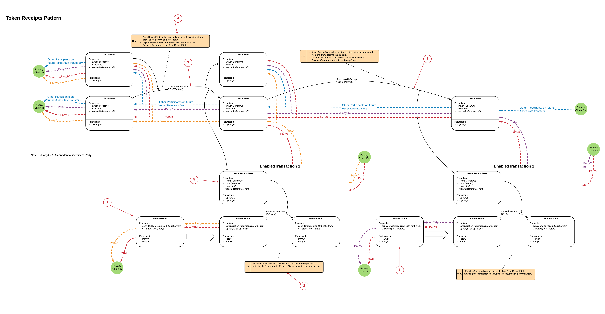

======================
Token Receipts Pattern
======================

:Status: Peer reviewed
:Implemented: No

-------
Summary
-------

Token receipts pattern can be used where evidence of an AssetState transition (change of owner) is required to enable a DependentState transition within a separate Transaction, specifically where:

 - Each set of AssetState transitions within a single Transaction should enable only one DependentState transition, no double spends.
 - Being a participant on the AssetState chain does not give the ability to resolve the DependentState Transactions.
 - Being a participant on a DependentState Transaction does not giver the ability to resolve details on other DependentState Transactions.
 - The AssetState uses Confidential identities to preserve privacy on the AssetState chain

The Token Receipts Pattern is an extension of the Receipts pattern, where the EnablerState is a fungible/ ownable AssetState.

-------
Context
-------

Often a Ledger transition is contingent on an asset movement. For example, A bond ownership change may be contingent on a cash token changing ownership.

-------
Problem
-------

One way of implementing this dependency is to put both transitions into the same Transaction. However, this has a potential privacy problem. in the Bond for Cash example, if that cash is subsequently used in an other transactions, the participants of the subsequent transaction will be able to resolve the details of the original transaction. This is unlikely to be acceptable, especially if the two transactions involve competing actors

Note, if the only confidential information in the states are the identities of the participants then Confidential Identities can be used instead of the receipts pattern.

---------------
Salient Factors
---------------

 - There will often be the requirement for one state transition (Enabler) to enable another state transition (Dependent)
 - When a Corda node resolves a transaction. It will obtain a copy of the previous Transactions which generated the input states for the current Transaction. It will then recursively resolve the input states on all previous transactions until it has the complete (Directed acyclic) graph required to prove the current transactions input states.
 - There will often be the requirements to preserve privacy across multiple Enabled transactions.
 - AssetStates can be fungible, in which case it is the net movement of the asset amount that dictates if the EnabledState transition can occur.

------------------------
Solution Walkthrough
------------------------

State Evolution diagram with Privacy overlay (see the Corda Modelling Notation section for details on how to read the diagram):

:Steps:

  1. An DependentState exists which has the pre-condition 'PartyA must Pay PartyB £90 with a transferReference ref2' in its considerationRequired property.

  2. The Contract for the DependentState specifies that the transition 'DependentCommand' is not permitted to occur unless the Transaction contains an AssetReceiptState showing that TransferWithReceipt transition has occurred on the AssetState Chain which matches the considerationRequired pre-condition.

  3. A Transaction is constructed using fungible AssetStates where the net movement of AssetStates matches the pre-conditions, using the TransferWithReceipt Command.

  4. As part of the transaction an AssetReceiptState is created. The Contract for the AssetState must ensure that the AssetReceiptState provably matches the transfer that occurred. ie in this case that net movement of £90 of AssetState moved from PartyA to PartyB and that the transferReference was 'ref2'.

  5. Once the AssetReceiptState has been created, it is used in Transaction 1 to enable the DependentCommand transition on DependentState.

  6. A seconded DependentState exists which has the pre-condition 'PartyB must Pay PartyC £90 with a transferReference ref3' in its considerationRequired property.

  7. A second TransferWithReceipt transaction is created, whereby PartyB transfers the Asset he previously receive in transfer ref2 to PartyC, this time the transferReference is ref3. An AssetReceiptState is create.

  8. The AssetReceiptState it is used in Transaction 2 to enable the DependentCommand transition on DependentState.

Note, this mechanism does not guarantee atomicity of the AssetState transition and the DependentState transition.

----------------
Privacy Analysis
----------------

The crux of the pattern is it's privacy characteristics. There are two important characteristics:

1) Privacy between DependentState Transactions:

 Let's assume that Transaction 1 is a business deal between Party B and Party A, Transaction 2 is a separate business deal between Party B and PartyC and that PartyC is a competitor of PartyA. Party A should not resolve any details of the PartyB-PartyC deal and PartyC should not resolve any details of the PartyB-PartyA deal. By following the Privacy trace for Party A from Transaction 1 (orange line) you can see that PartyA does not resolve Transaction 2. By following the Privacy trace for PartyC (purple line) from Transaction 2 you can see that PartyC does not resolve Transaction 1.

2) Privacy from AssetState Participants

 When the participants on the AssetState chain resolve their Transactions they will only resolve down the AssetState chain, they will never resolve any of the DependentState Transactions which the AssetReceiptStates were used to enable. This is shown by the blue Privacy trace.

 This assumes that the participants on the AssetState chain are not participants on the DependentState Transactions, because then they'd get to see the Transaction anyway.

3) Confidential identities.

  In order to avoid Participants on the AssetState chain seeing who owned the AssetState before them, which may leak confidential information, Confidential identities should be used in the AssetStates.

---------------------------
Extensions - to investigate
---------------------------
 - Timewindows to perform transfer/ other limits on what the EnabledState can do

 - Pattern could be simplified if the initial asset owner performs a transaction with themselves to create an asset state with the exact amount of asset required, ie removing the need for a 'change' state in the asset transfer transaction

 - Patterns to prevent the spending away of the EnabledState once Payment has been made (asset lock)
