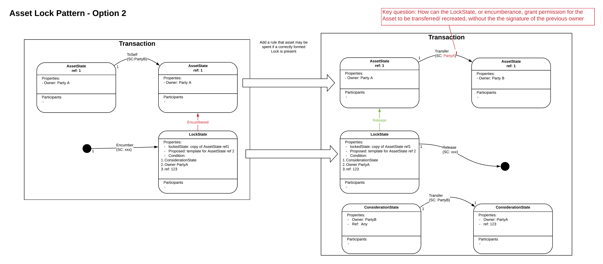

==================
Asset Lock Pattern
==================

:Status: Ready for review
:Implemented: No, still under design review

-------
Summary
-------

An asset lock is a mechanism, used during a two party agreement, that prevents one party spending or distributing the asset involved in the agreement elsewhere.
The lock enables a named asset to be locked out of use until another event has happened. The mechanism further allows the asset to be unlocked once an certain event has occured

-------
Context
-------

When we want to transfer an asset state from one party to another, we often need to ‘freeze’ the asset while the transaction occurs, as if to put it in a kind of escrow until another event or transaction has occurred.
One of the most common examples of this kind of event would be a payment for the asset such that the asset is locked until the new owner has made payment. Once payment or proof-of-payment has occured the lock can be lifted, allowing the buyer to accept ownership of the asset. This pattern is not restricted to payments and could be used for essentially any state change at all.

-------
Problem
-------

The need for such an lock stems from the potential for nefarious actors to attempt to:

- Transact the same asset with a different party while a deal is underway.
- Spend states away mid pattern to benefit one party.
- Offer a state but substitute a fake state (i.e. one without the assumed provenance)
- Pledge a state from an invalid transaction.
- Use a state used to power two transitions of the same value in same transaction.
- Use a state used to power more than one transaction using reference states

-------------
Forces/Factors
-------------

The challenge is to set up the lock so that the lock can be released by somebody other than the owner once they have provided some consideration. This is difficult as the asset's own contract rules are likely to state that the current owner needs to sign to transfer ownership.

---------
Solution
---------

There are four proposed patterns put forward. Each of these is described separately below.

**1.    Pre-permissioned pattern with regular states**

a) *Description & Walkthrough*

.. image:: resources/Asset-Lock-option-1.png
  :width: 80%
  :align: center

The transfer of the asset occurs over two transactions:

**Tx 1**: includes the AssetState itself as an input state and a LockState. The AssetState contains an owner property and any other arbitrary properties. The LockState contains the following properties:

    - `locked`: this is a copy of the input asset state in this transaction.
    - `proposed`: a new proposed template or version of the Asset state, which will be used in transaction 2.
    - `considerationState`: this a state that acts as either payment or proof-of-payment between A and B.
    - A reference ID

After this transaction successfully occurs the asset state becomes consumed. This transaction must be signed by the owner or seller of the asset.

**Tx 2**: This transaction encompasses the actual transfer of asset ownership from Party A to Party B. The input LockState is the output state of Tx 1. The input and output ConsiderationState is a state transfer that is used to denote the payment provided for the asset.

b. *Analysis & Considerations*

  - Since the original asset is consumed as part of Tx 1, Party A cannot sell the asset to a different party while a deal is underway or anywhere mid-pattern.
  - Since the AssetState is reference in the LockState in Tx 1 it is not possible to substitute a bogus state in Tx 2 i.e. one without the assumed provenance.
  - Party B cannot consume a state in an invalid Tx 2 because if Tx 1 fails then the LockState will not be created as an output state thus Tx 2 cannot happen.
  - Since the LockState is consumed it cannot be used in multiple transactions similar Tx 2. The same applies to ConsiderationState. Furthermore, reference states are not used as part of this transaction so there is no risk of one state being used in multiple transactions.
  - Since it is a bilateral agreement, privacy is shared between the two participants.

**2.    Pre-permissioned pattern with encumbered states**

a) *Description & Walkthrough*

b. *Analysis & Considerations*

**3.    State property pre-condition lock**

a) *Description & Walkthrough*

.. image:: resources/Asset-Lock-option-3.png
  :width: 80%
  :align: center

b. *Analysis & Considerations*

**4.    Pre-permissioned pattern with reference states**

a) *Description & Walkthrough*

.. image:: resources/Asset-Lock-option-4.png
  :width: 80%
  :align: center

b. *Analysis & Considerations*

doesn’t actually lock the asset, so not an asset lock, it only gives the ability for someone other than the owner to move the asset.

-------
Benefits
-------

Particular benefits of using this pattern

-------
Drawbacks
-------

draw backs of using this pattern

----------------
Related Patterns
----------------

List related Patterns

Extensions:

List possible Extensions

The asset lock pattern purpose is to enable an asset to be locked out of use pending another event happening which allows the asset to be unlocked and transferred to a new Owner.

The challenge is to set up the lock so that the lock can be released by somebody other than the owner once they have provided some consideration. This is difficult as the asset's own contract rules are likely to state that the current owner needs to sign to transfer ownership.

It is likely that the asset has to have a rule that says it can be transferred without the owners signature if some form of precondition is proved to have been met. eg a lock state signed by the owner specifying asset that can be transferred, who it is transferred to and the condition for the transfer.

for option reference states - doesn't actually lock the asset, so not an asset lock, it only gives the ability for someone other than the owner to move the asset.

Note, if need to guarantee that only a specific counterparty can pay the consideration, then the counterparty can pass H(Secret) to the asset owner. when the asset owner creates the asset lock, a pre-condition is that the consideration state must reveal the matching secret.
