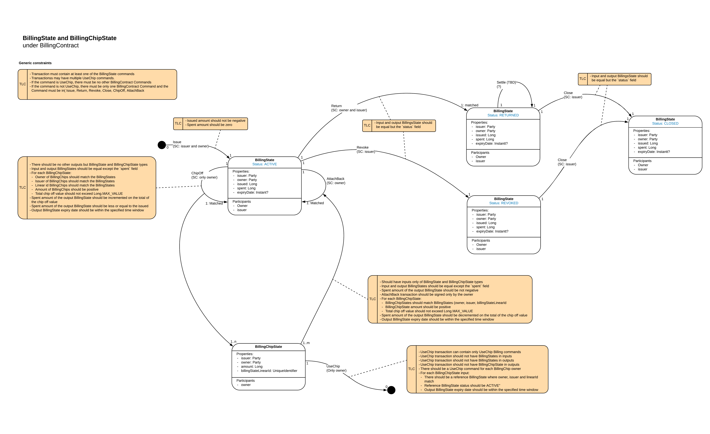

===============================
Billing With ChipOffs/ Receipts
===============================

WIP

-------
Summary
-------

Allows a Business Network Operator (BNO) to Bill for transactions occuring on a Corda network without being a participant on, or receiveing copies of, those transactions.

------------
Key features
------------

- uses the Receipts pattern

The 'Billing With Chip Offs' Pattern can be used for billing and metering on Business Networks. The Pattern has a notion of Billing Chips that can be included into Corda transactions which participants need to pay for. Billing Chips never cross a single transaction boundaries (when created, Billing Chips can be consumed in an exactly one transaction) and hence never cause privacy leaks. All Billing Chips are attached to their respective Billing States, that accumulate the total spent amount and can be safely reported back to the BNO without leaking the transaction history which the in Billing Chips have been involved.

Diagrams:

.. image:: resources/Billing-State-evolution-diagram-v2.png
  :width: 80%
  :align: center

