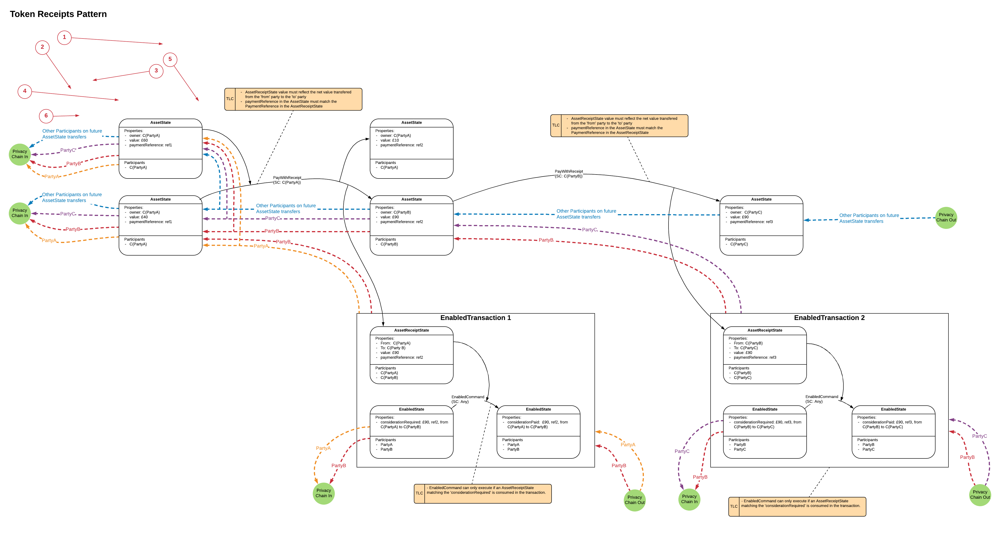

======================
Token Receipts Pattern
======================

:Status: Work In Progress
:Implemented: No

-------
Summary
-------

Token receipts pattern can be used where evidence of an AssetState transition (change of owner) movement is required to enable a Transition within a separate Transaction (EnabledTransaction), specifically where:

- Each set of AssetState transitions within a single transaction should enable only one EnabledTransaction, no double spends.
- Being a participant on the AssetState chain, does not give the ability to resolve the EnabledTransactions. (Although some participants will also be participants on the EnabledTransactions)
- Being a participant on an EnabledTransaction does not giver the ability to resolve details on other EnabledTransactions. (Although some participants will also be participants on other EnabledTransactions)
- The AssetState uses Confidential identities to preserve privacy on the AssetState chain

The Token Receipts Pattern is an extension of the Receipts pattern, where the EnablerState is a fungible/ ownable AssetState.

------------------------
Explanation/ Walkthrough
------------------------

State Evolution diagram with Privacy overlay (see the Corda Modelling Notation section for details on how to read the diagram):

:Steps:

  1. An EnabledState exists which has the pre-condition 'PartyA must Pay PartyB £90 with a transferReference ref2' in its considerationRequired property.

  2. The Contract for the EnabledState specifies that the transition 'EnabledCommand' is not permitted to occur unless the EnabledTransaction contains an AssetReceiptState showing that TransferWithRecipt transition has occurred on the AssetState Chain which matches the considerationRequired pre-condition.

  3. A transaction is constructed using fungible AssetStates where the net movement of AssetStates matches the pre-conditions, using the TransferWithReceipt Command.

  4. As part of the transaction an AssetReceiptState is created. The Contract for the AssetState must ensure that the AssetReceiptState provably matches the transfer that occurred. ie in this case that net movement of £90 of AssetState moved from PartyA to PartyB and that the transferReference was 'ref2'.

  5. Once the AssetReceiptState has been created, it is used in EnabledTransaction 1 to enable the EnabledCommand transition on EnabledState.

  6. A seconded EnabledState exists which has the pre-condition 'PartyB must Pay Partyc £90 with a transferReference ref3' in its considerationRequired property.

  7. A second TransferWithReceipt transaction is created, whereby PartyB transfers the Asset he previously receive in transfer ref2 to PartyC, this time the transferReference is ref3. An AssetReceiptState is create.

  8. The AssetReceiptState it is used in EnabledTransaction 2 to enable the EnabledCommand transition on EnabledState.

----------------
Privacy Analysis
----------------

The crux of the pattern is its privacy characteristics. There are two important characteristics:

1) Privacy between EnabledTransactions:

 Let's assume that EnabledTransaction 1 is a business deal between Party B and Party A, EnabledTransaction2 is a separate business deal between Party B and PartyC and that PartyC is a competitor of PartyA. Party A should not resolve any details of the PartyB-PartyC deal and PartyC should not resolve any details of the PartyB-PartyA deal. By following the Privacy trace for Party A from EnabledTransactoin 1 (orange line) you can see that PartyA does not resolve EnabledTransaction 2. By following the Privacy trace for PartyC (purple line) from EnabledTransaction 2 you can see that PartyC does not resolve EnabledTransaction 1.

2) Privacy from AssetState Participants

 When the participants on the AssetState chain resolve their transactions they will only resolve down the AssetState chain, they will never resolve any of the EnabledTransactions which the AssetReceiptStates were used to enable. This is shown by the blue Privacy trace.

 This assumes that the participants on the AssetState chain are not participants on the EnabledTransactions, because then they'd get to see the EnabledTransaction anyway.

3) Confidential identities.

  In order to avoid Participants on the AssetState chain seeing who owned the AssetState before them, which may leak confidential information, Confidential identities should be used in the AssetStates.

--------------------------
Extensions - to brainstorm
--------------------------
 - Timewindows to perform transfer/ other limits on what the EnabledState can do

 - Pattern could be simplified if the initial asset owner performs a transaction with themselves to create an asset state with the exact amount of asset required, ie removing the need for a 'change' state in the asset transfer transaction

 - Patterns to prevent the spending away of the EnabledState once Payment has been made (asset lock)
