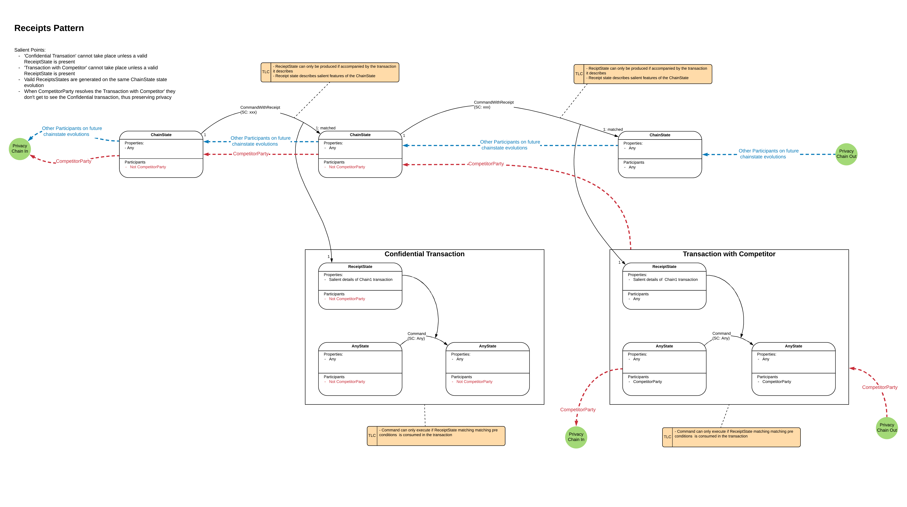

======================
Token Receipts Pattern
======================

WIP

The receipts pattern can be extend so that the Chain state is a asset/ Cash. The receipts can then be used to evidence payment in a another transaction which allows some other event to occur, eg movement of another asset.

In the diagram below:
 - Chainstate -> CashState
 - AnyState -> some business State which only transitions if the cash receipt is present to prove prior payment

The Cash state would likely use Confidential identities to preserve privacy along the Cash evolution chain.

